# Deep Technology Agents - Architecture & Execution Documentation

## 1. COMPLETE SYSTEM ARCHITECTURE

### Mermaid
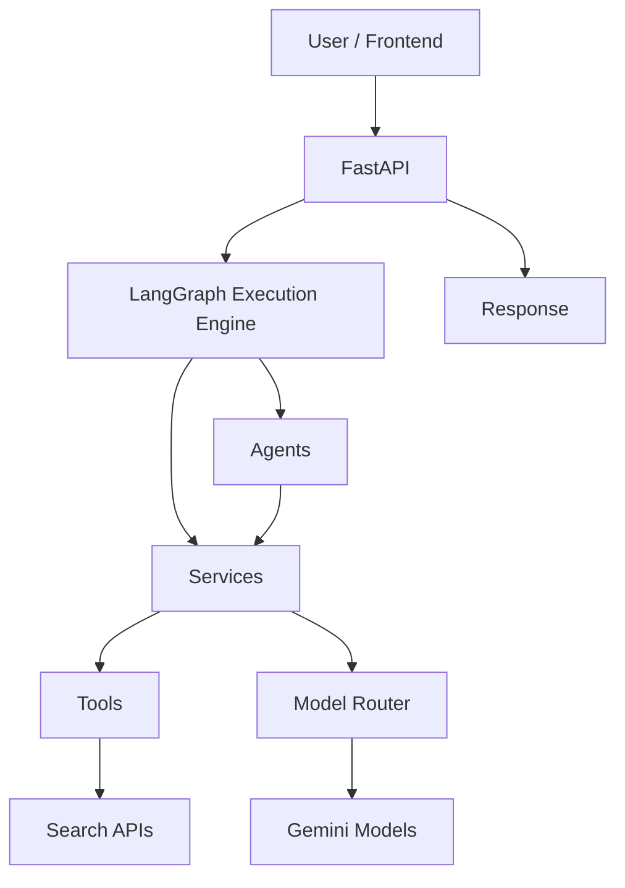

### PlantUML
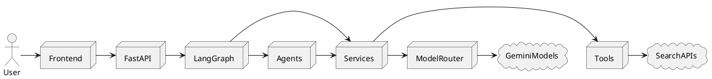

### Markdown Explanation
The system follows a layered architecture where FastAPI receives requests and triggers the LangGraph state machine. LangGraph coordinates Agents and Services. Services interface with External Tools and Gemini Models (via a Model Router).

### Short Description
High-level topology of the Deep Technology Agents platform.

### Components Involved
Frontend, FastAPI, LangGraph, Agents, Services, Tools, Model Router, Gemini Models, Search APIs.

### Data Flow
User Input -> FastAPI -> LangGraph -> Agents -> Services -> Models/Tools -> Response.

### Failure Points
FastAPI overload, LangGraph state corruption, External API timeouts.

### Recovery Strategy
FastAPI rate limiting, State checkpointing, Service-level retry/circuit breakers.

## 2. LANGGRAPH EXECUTION GRAPH

### Mermaid
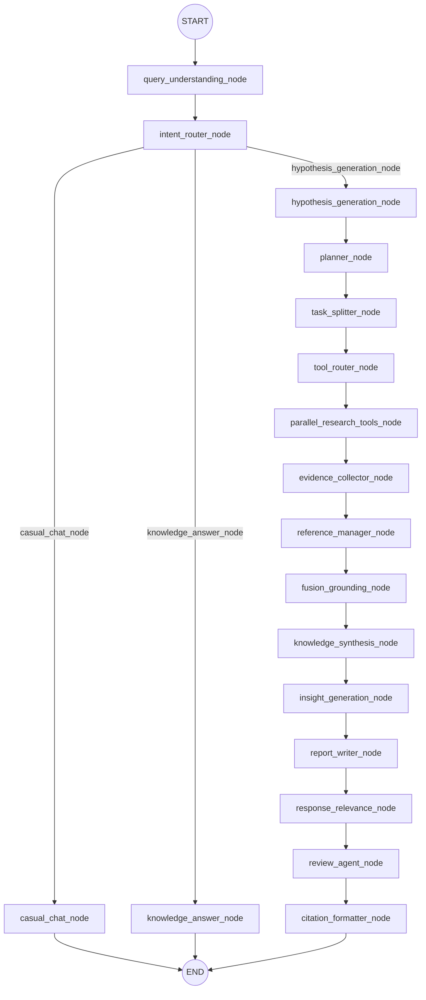

### PlantUML
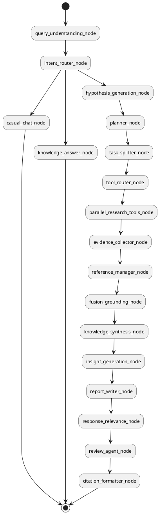

### Markdown Explanation
Exact 1:1 mapping of `builder.py` edge definitions. Routes separate deep research from casual chat. The deep research path skips modular validation (duplicate detection, credibility scoring, etc.) for performance via a fast-path.

### Short Description
Visual representation of the LangGraph DAG state machine.

### Components Involved
All node functions in `nodes.py` and state configuration in `builder.py`.

### Data Flow
GraphState is passed linearly down the pipeline, accumulating arrays of data.

### Failure Points
Node execution errors interrupting the pipeline flow.

### Recovery Strategy
Graph-level checkpointing and internal exception catching (appending to `errors` array in GraphState).

## 3. COMPLETE EXECUTION FLOW

### Mermaid
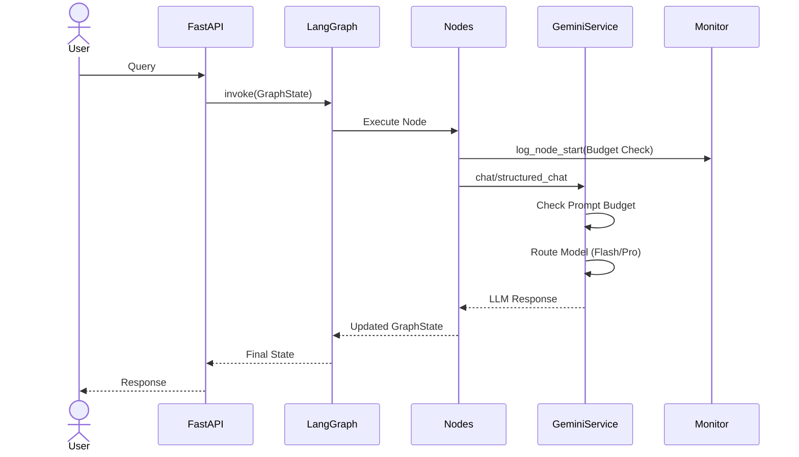

### PlantUML
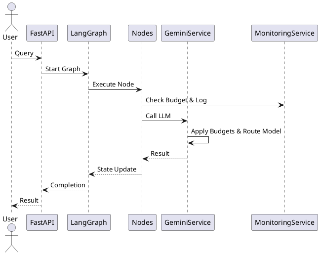

### Markdown Explanation
End-to-end execution flow emphasizing cross-cutting concerns like Monitoring, Execution Budget enforcement, and Prompt Budgets handled dynamically during Node execution.

### Short Description
Detailed sequential flow of an interaction.

### Components Involved
User, FastAPI, LangGraph, All Nodes, GeminiService, MonitoringService.

### Data Flow
Queries flow inward, execute via LLM routing, and cascade state updates backward.

### Failure Points
Execution Budget Timeout, Prompt size overflows.

### Recovery Strategy
Nodes preemptively exit loop if budget < 30s; GeminiService chunk-splits massive prompts automatically.

## 4. SEQUENCE DIAGRAM

### Mermaid
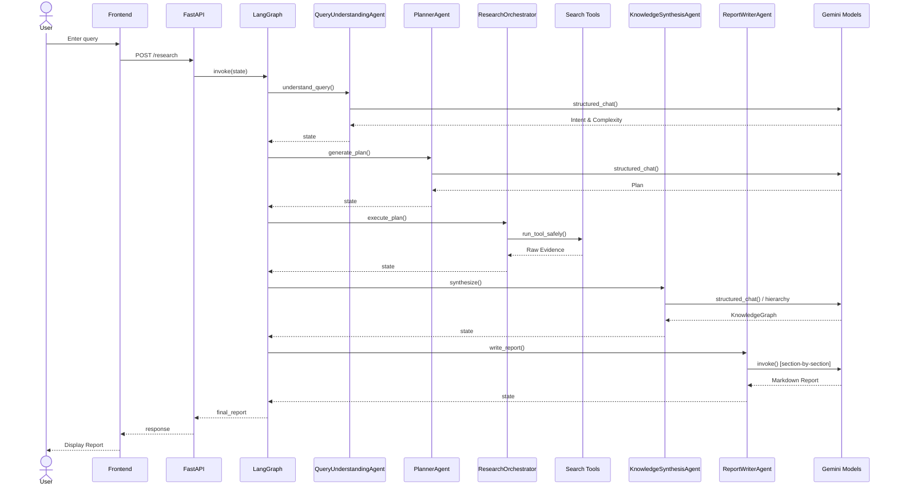

### PlantUML
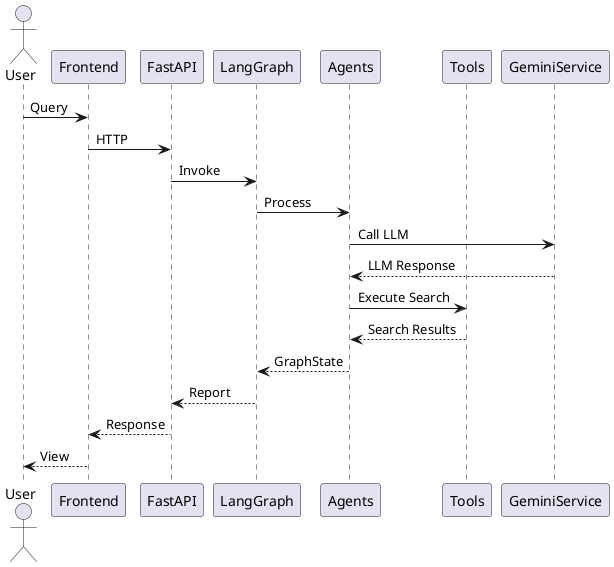

### Markdown Explanation
A strict UML Sequence diagram showing synchronous and asynchronous interactions between distinct actors, software boundaries, and models.

### Short Description
End-to-end API interaction sequence.

### Components Involved
Frontend, API, Graph, Specific Agents, Tools, Gemini API.

### Data Flow
Request payload -> GraphState mutation -> Output payload.

### Failure Points
Network failures between Frontend/FastAPI or Tools.

### Recovery Strategy
Frontend retry mechanism; Tool isolated safe wrappers return empty/error statuses gracefully.

## 5. GRAPHSTATE DIAGRAM

### Mermaid
```mermaid
classDiagram
  class GraphState {
    +str query
    +list messages
    +str response
    +list steps
    +dict metadata
    +list errors
    +list sources
    +float execution_time
    +list subtask_evidence
    +dict structured_query
    +dict hypothesis_draft
    +dict grounded_draft
    +dict relevance_metrics
    +dict reference_map
    +list citations
    +list evidence_traceability
    +str intent
    +int research_score
    +str mode
    +dict research_plan
    +list tasks
    +list keywords
    +str domain
    +str complexity
    +list recommended_tools
    +list research_results
    +list completed_tools
    +list failed_tools
    +list raw_evidence
    +int evidence_count
    +dict tool_statistics
    +dict collection_metadata
    +list unique_evidence
    +list duplicate_groups
    +dict credibility_scores
    +list conflicts
    +dict confidence_scores
    +list validated_evidence
    +list discarded_evidence
    +dict validation_report
    +str validation_summary
    +dict knowledge
    +str executive_summary
    +list topic_summaries
    +list entities
    +list facts
    +list timelines
    +list relationships
    +list statistics
    +list terminology
    +dict knowledge_graph
    +list insights
    +list trend_analysis
    +list comparisons
    +list risks
    +list opportunities
    +list limitations
    +list future_research
    +list strategic_takeaways
    +str final_report
    +str reviewed_report
    +dict quality_scores
    +dict quality_report
    +str review_summary
    +list improvements
    +list issues_found
  }
```

### PlantUML
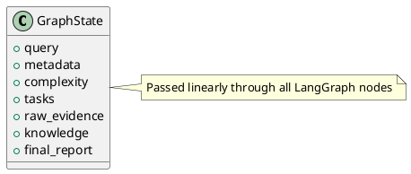

### Markdown Explanation
The `GraphState` is a Python `TypedDict` containing every state variable mapped via `operator.add` for lists or overwritten for strings/dicts. `query_understanding_node` sets `metadata`, `query`, `complexity`. `planner_node` sets `tasks`, `research_plan`. `parallel_research_tools_node` sets `subtask_evidence`, `raw_evidence`. `knowledge_synthesis_node` sets `knowledge`.

### Short Description
The immutable data structure driving the pipeline.

### Components Involved
`state.py`, all `nodes.py`.

### Data Flow
Passed explicitly into every async node function.

### Failure Points
Type mismatches if an agent returns unexpected JSON schemas.

### Recovery Strategy
Pydantic schema validation inside `GeminiService` forces strict compliance before appending to GraphState.

## 6. AGENT INTERACTION DIAGRAM

### Mermaid
```mermaid
graph LR
  Q[QueryUnderstandingAgent] --> I[IntentRouterAgent]
  I --> H[HypothesisGenerationAgent]
  H --> P[PlannerAgent]
  P --> RO[ResearchOrchestrator]
  RO --> E[EvidenceCollectorAgent]
  E --> RM[ReferenceManagerAgent]
  RM --> FG[FusionGroundingAgent]
  FG --> KS[KnowledgeSynthesisAgent]
  KS --> IN[InsightGenerationAgent]
  IN --> RW[ReportWriterAgent]
  RW --> RE[ResponseRelevanceAgent]
  RE --> RV[ReviewAgent]
  RV --> CF[CitationFormatterAgent]
```

### PlantUML


### Markdown Explanation
Shows the logical dependency chain between Agents. While they don't directly call each other's code (LangGraph mediates), their input/output shapes are inherently coupled.

### Short Description
Logical dependency mapping of all agents.

### Components Involved
All files in `app/agents/`.

### Data Flow
Agent -> LangGraph -> Agent.

### Failure Points
Agent hallucinates an output breaking downstream agent assumptions.

### Recovery Strategy
Downstream agents have strict schema parsers or fallback logic (e.g. ReportWriter returns a generic fallback if knowledge is empty).

## 7. SERVICE INTERACTION DIAGRAM

### Mermaid
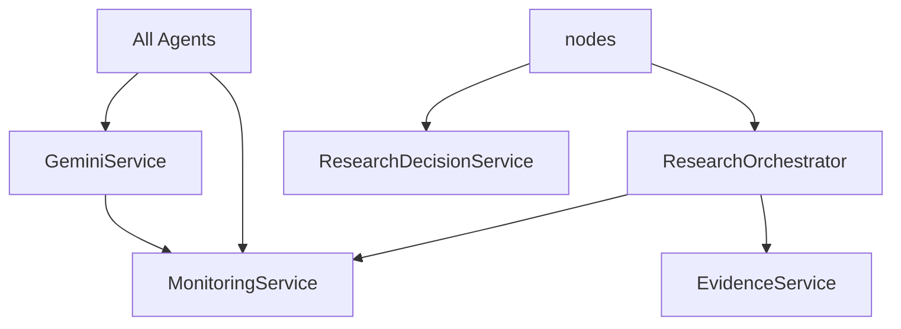

### PlantUML
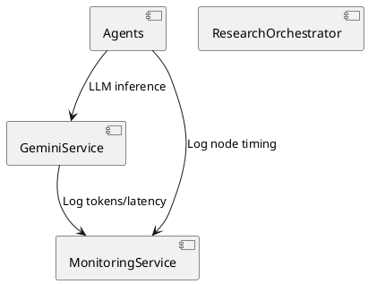

### Markdown Explanation
Highlights utility services shared across nodes. `GeminiService` handles all AI via a Model Router. `MonitoringService` acts as a global singleton capturing telemetry.

### Short Description
Dependencies between Agents and core Services.

### Components Involved
`app/services/*`.

### Data Flow
Agents pass string/schemas to Services, Services perform side-effects or network calls.

### Failure Points
Service singleton bottlenecks or thread safety (asyncio handles this natively).

### Recovery Strategy
Services wrap network calls in `try/except`.

## 8. MODEL ROUTER FLOW

### Mermaid
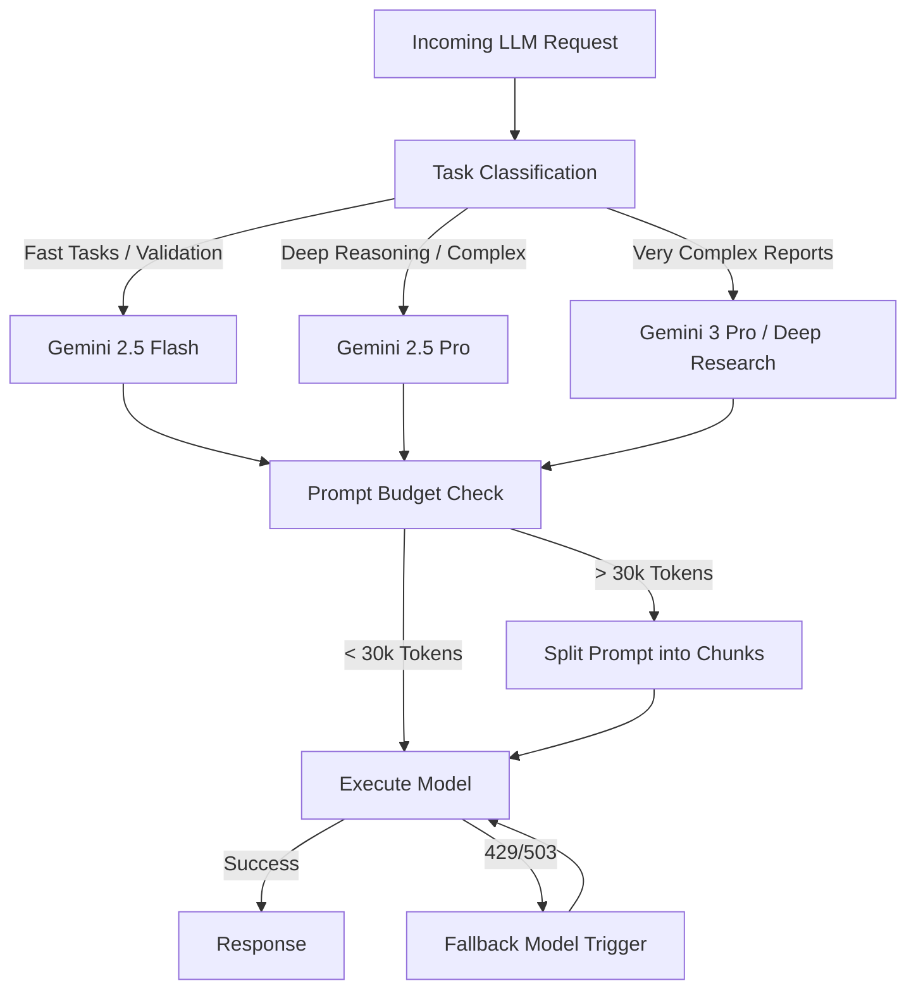

### PlantUML
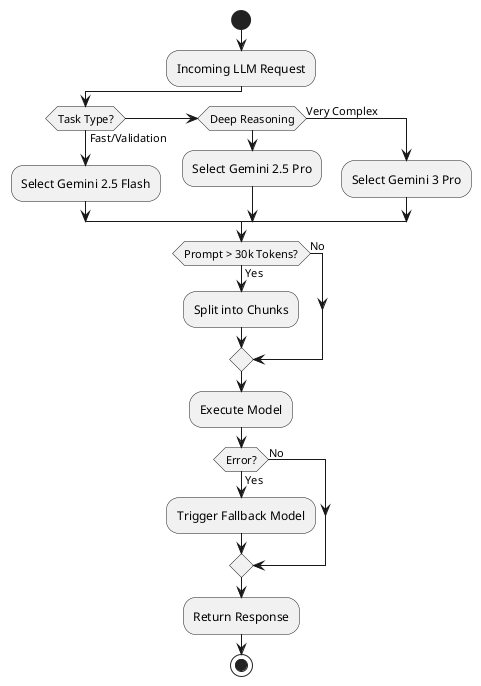

### Markdown Explanation
The `route_model` in `GeminiService` assigns the optimal LLM based on task type and complexity parameter. It enforces token budgets and uses LangChain fallbacks for resiliency.

### Short Description
Dynamic intelligence routing.

### Components Involved
`GeminiService.route_model`, `GeminiService.chat`, `GeminiService.structured_chat`.

### Data Flow
Task Type/Complexity -> Model Selection -> Chunking -> API Call -> Fallback -> Result.

### Failure Points
All models in the fallback chain fail.

### Recovery Strategy
Raise exception, caught by Node execution wrapper, logs error to GraphState, pipeline degrades gracefully.

## 9. SEARCH PIPELINE

### Mermaid
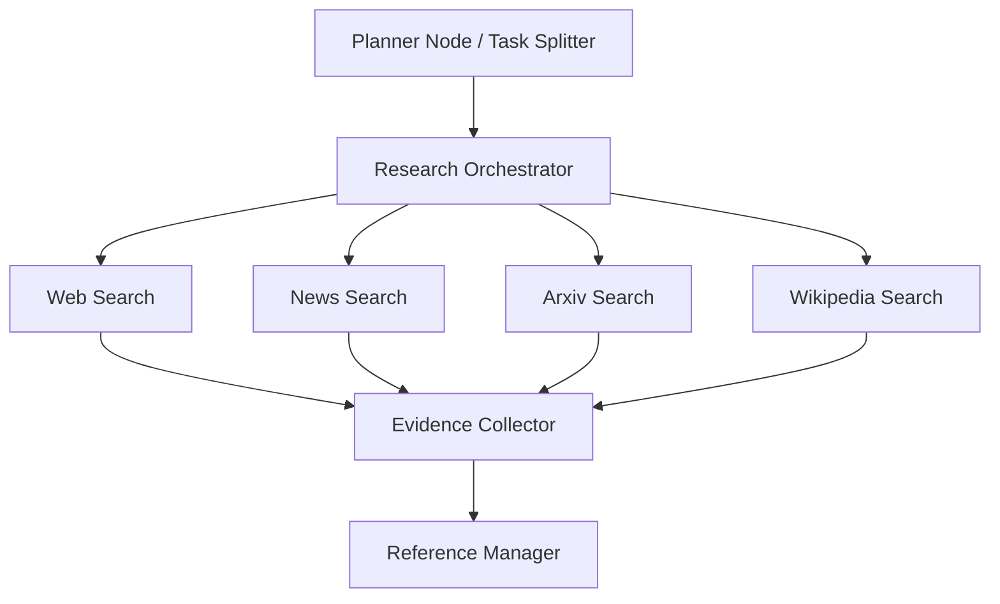

### PlantUML
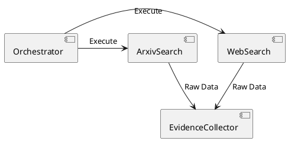

### Markdown Explanation
Tools are executed concurrently via `asyncio.gather` in `ResearchOrchestrator`. Tool selection is recommended by `PlannerAgent`. All raw output funnels into `EvidenceCollectorAgent` for normalization into `EvidenceItem` schemas.

### Short Description
Parallel data ingestion pipeline.

### Components Involved
`PlannerAgent`, `ResearchOrchestrator`, `tools/*`, `EvidenceCollectorAgent`.

### Data Flow
Queries -> Tools -> Array of dictionaries -> Normalization -> GraphState.

### Failure Points
Rate limits on APIs (e.g., DuckDuckGo, Arxiv).

### Recovery Strategy
Orchestrator staggers requests (delay logic) and uses `try/except` per tool. A failure in one tool does not kill the others.

## 10. REPORT GENERATION FLOW

### Mermaid
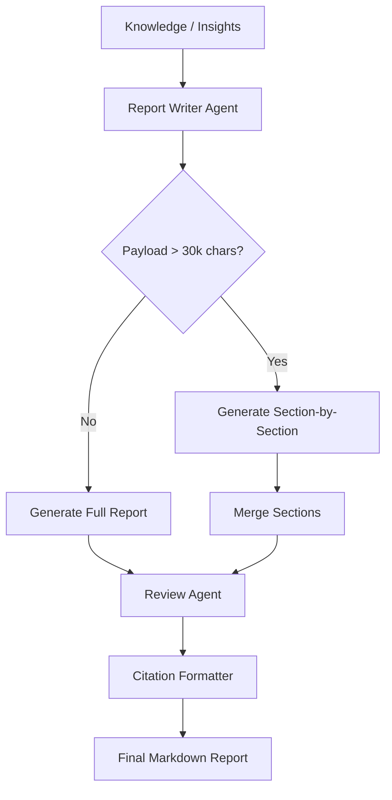

### PlantUML
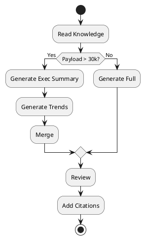

### Markdown Explanation
Shows Adaptive Report Writing. To avoid exceeding context limits for Massive documents, `ReportWriterAgent` splits the task into structural loops (Executive Summary, Risks, etc.) and concatenates them before review.

### Short Description
Adaptive structural document generation.

### Components Involved
`ReportWriterAgent`, `ReviewAgent`, `CitationFormatterAgent`.

### Data Flow
JSON Knowledge -> Section Iteration / Full Prompt -> Markdown -> Markdown with Footnotes.

### Failure Points
LLM refuses to generate a specific section.

### Recovery Strategy
Agent traps failure per section, skips it, and merges the rest, guaranteeing a partial report.

## 11. FAULT TOLERANCE FLOW

### Mermaid
```mermaid
graph TD
  subgraph External API Failure
  T[Tool Execution] --> F{Fails?}
  F -- Yes --> C[Catch Exception, Log]
  C --> CO[Continue without Tool]
  end
  subgraph LLM Failure
  L[Gemini Request] --> LF{Fails?}
  LF -- 429/503 --> FB[Fallback Model]
  FB --> L2{Fails?}
  L2 -- Yes --> LG[Log Error to GraphState]
  LG --> GD[Graceful Degradation]
  end
  subgraph Execution Timeout
  ND[Node Loop] --> TM{Time > 150s?}
  TM -- Yes --> BR[Break Loop / Stop Searches]
  BR --> SYN[Proceed to Synthesis]
  end
```

### PlantUML
```plantuml
@startuml
node Tool
node CatchBlock
Tool --> CatchBlock: Exception
CatchBlock --> Tool: Proceed with others
node Gemini
node Fallback
Gemini --> Fallback: 429 Error
@enduml
```

### Markdown Explanation
Visualizes the three pillars of resilience: Tool Isolation, LLM Model Failover (via LangChain fallbacks), and Global Execution Budget constraints (stopping loops preemptively).

### Short Description
Resilience and recovery diagrams.

### Components Involved
`ResearchOrchestrator`, `GeminiService`, `nodes.py` (Timer checks).

### Data Flow
Errors -> Catch -> Log via Monitor -> State modification or continuation.

## 12. MONITORING FLOW

### Mermaid
```mermaid
graph LR
  N[LangGraph Nodes] -->|log_node_start| MS[MonitoringService]
  GS[GeminiService] -->|log_llm_execution| MS
  RO[ResearchOrchestrator] -->|log_tool_execution| MS
  MS --> LOG[Terminal/Log Files]
  MS --> MET[Metrics Dictionary]
```

### PlantUML
```plantuml
@startuml
component Nodes
component MonitoringService
Nodes -> MonitoringService: Push Telemetry
MonitoringService -> Logs: Flush
@enduml
```

### Markdown Explanation
The `MonitoringService` acts as a central telemetry sink for node timings, LLM latencies, prompt sizes, and tool failures.

### Components Involved
`MonitoringService`, `app/utils/logger.py`.

## 13. COMPONENT DEPENDENCY DIAGRAM

### Mermaid
```mermaid
graph TD
  API[app/main.py] --> G[app/graph/builder.py]
  G --> N[app/graph/nodes.py]
  N --> A[app/agents/*.py]
  N --> S[app/services/*.py]
  A --> S
  A --> SC[app/schemas/*.py]
  A --> P[app/prompts/*.py]
  S --> T[app/tools/*.py]
  S --> U[app/utils/*.py]
```

### PlantUML
```plantuml
@startuml
package API
package Graph
package Agents
package Services
package Schemas
package Tools
API --> Graph
Graph --> Agents
Graph --> Services
Agents --> Services
Agents --> Schemas
Services --> Tools
@enduml
```

### Markdown Explanation
Strict hierarchical dependency graph ensuring no circular imports. Agents rely on Services, which rely on Utilities/Tools. Schemas and Prompts are leaf nodes.

## 14. DIRECTORY STRUCTURE DIAGRAM

### Mermaid
```mermaid
graph LR
  R[Root] --> B[backend/]
  B --> APP[app/]
  APP --> AG[agents/]
  APP --> AP[api/]
  APP --> CF[config/]
  APP --> GR[graph/]
  APP --> PR[prompts/]
  APP --> SC[schemas/]
  APP --> SV[services/]
  APP --> TL[tools/]
  APP --> UT[utils/]
```

### PlantUML
```plantuml
@startuml
folder backend {
  folder app {
    folder agents
    folder services
    folder graph
  }
}
@enduml
```

### Markdown Explanation
Visual tree mapping of the Python FastAPI/LangGraph backend modular design.

## 15. END-TO-END RUNTIME FLOW

### Mermaid
```mermaid
graph TD
  START((User Query)) --> QA[Understanding & Intent]
  QA --> ROUTE{Deep Research?}
  ROUTE -- No --> FAST[Fast LLM Reply] --> END((Response))
  ROUTE -- Yes --> PLAN[Planning & Task Splitting]
  PLAN --> LP[Parallel Search Loop]
  LP --> T1[Tool 1] & T2[Tool 2] & T3[Tool 3]
  T1 --> EV[Evidence Collection]
  T2 --> EV
  T3 --> EV
  EV --> HKS[Hierarchical Knowledge Synthesis]
  HKS --> INS[Insight Extraction]
  INS --> REP[Adaptive Report Generation]
  REP --> REV[Review & Citations]
  REV --> END
```

### PlantUML
```plantuml
@startuml
(*) --> Understanding
Understanding --> Planning
Planning --> ParallelSearch
ParallelSearch --> Synthesis
Synthesis --> ReportGeneration
ReportGeneration --> (*)
@enduml
```

### Markdown Explanation
The absolute highest-level, most exhaustive representation of the complete pipeline processing a complex user request, highlighting parallel branches converging on synthesis.

### Components Involved
Entire Backend Architecture.

### Data Flow
Raw Text -> Structured Intent -> Array of Subtasks -> Array of Evidence Arrays -> Merged Knowledge Graph -> Sectioned Markdown -> Final Formatted Markdown.
