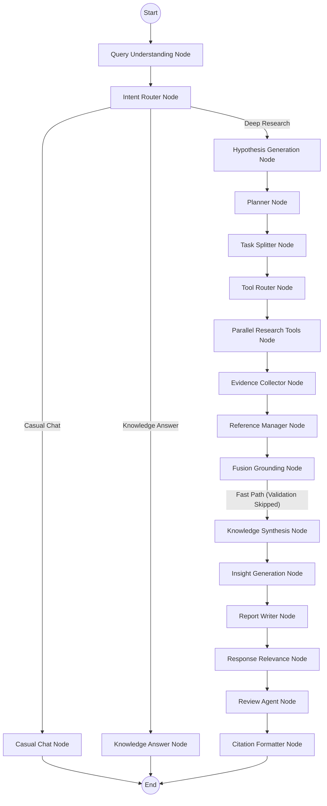

# Deep Technology Agents System Flow

This document details the step-by-step execution flow of the Deep Technology Agents platform. The entire workflow is managed by a LangGraph DAG (Directed Acyclic Graph), powered by specialized agents and central services.

## 1. High-Level Flowchart

## 2. Step-by-Step Execution Sequence

### Phase 1: Ingestion & Routing
1. **User Query Received:** A user submits a prompt via the frontend.
2. **`query_understanding_node`:**
   - **Action:** Triggers the `QueryUnderstandingAgent`.
   - **Logic:** Detects query intent, extracts entities/keywords, calculates the **Complexity** (Simple, Medium, Complex, Very Complex), and initializes the `MonitoringService` and the Global Execution Timer (180s).
3. **`intent_router_node`:**
   - **Action:** Uses the `ResearchDecisionService` to determine the interaction mode.
   - **Routing:** If trivial, the graph routes directly to `casual_chat_node` or `knowledge_answer_node` for instant responses (bypassing the pipeline). If research is required, it proceeds to the Deep Research path.

### Phase 2: Planning & Decomposition
4. **`hypothesis_generation_node`:**
   - **Action:** Generates an initial hypothesis/assumption based on the structured query to guide the search.
5. **`planner_node`:**
   - **Action:** Triggers the `PlannerAgent`.
   - **Logic:** Creates a structured `ResearchPlan` including required tasks, focus keywords, and recommended tools.
6. **`task_splitter_node`:**
   - **Action:** Analyzes query complexity.
   - **Logic:** If the query is `Complex` or `Very Complex`, it dynamically prompts Gemini to decompose the query into multiple smaller, highly focused independent research sub-tasks.

### Phase 3: Independent Research Execution
7. **`parallel_research_tools_node`:**
   - **Action:** Orchestrates the tools using the `ResearchOrchestrator`.
   - **Logic:** 
      - Loops through all sub-tasks.
      - *Execution Budget Check:* Prevents new searches if the 180s timer is nearly exhausted.
      - Dispatches parallel searches (Web, Wikipedia, Arxiv, News) wrapped in isolated `try/except` blocks to guarantee **Fault Tolerance**.
8. **`evidence_collector_node`:**
   - **Action:** Normalizes and centralizes evidence.
   - **Logic:** Standardizes all scraped data into a unified schema, ensuring compatibility while maintaining clear boundaries between evidence from different sub-tasks.

### Phase 4: Grounding & Synthesis
9. **`reference_manager_node` & `fusion_grounding_node`:**
   - **Action:** Maps citations and fuses the raw evidence with the initial hypothesis.
10. **`knowledge_synthesis_node`:**
    - **Action:** Triggers the `KnowledgeSynthesisAgent`.
    - **Logic:** 
      - **Simple Queries:** Synthesizes the raw data directly into `KnowledgeGraph`, `Facts`, and `Entities`.
      - **Complex Queries:** Performs **Hierarchical Synthesis** — it first generates Local Summaries for each individual sub-task independently, and then merges them into a Global Knowledge Summary to avoid context window explosion.

### Phase 5: Reporting & Quality Control
11. **`insight_generation_node`:**
    - **Action:** Extracts strategic intelligence (risks, opportunities, competitor trends) from the synthesized knowledge.
12. **`report_writer_node`:**
    - **Action:** Triggers the `ReportWriterAgent`.
    - **Logic:** Drafts the final markdown report. Uses **Adaptive Generation**: if the payload exceeds 30,000 characters, it dynamically queries the model section-by-section and concatenates the output.
13. **`response_relevance_node` & `review_agent_node`:**
    - **Action:** Checks for hallucinations, scores the report quality against the raw facts, and identifies any necessary improvements.
14. **`citation_formatter_node`:**
    - **Action:** Injects proper inline references mapping back to the URLs collected during Phase 3.
15. **Workflow Complete:** The final validated report is returned to the FastAPI endpoint and streamed to the user.

---

## 3. Background Services

*   **`GeminiService` (Model Router):** All interactions with the LLM in the above nodes route through this service. It checks the **Prompt Budget** (auto-splitting if >30k tokens), manages fallbacks/retries for `429/503` errors, and dynamically switches models (`gemini-2.5-flash` vs `gemini-2.5-pro`) based on `task_type` and `complexity`.
*   **`MonitoringService`:** Actively logs latencies, token consumption, and retry attempts continuously as the graph executes.
